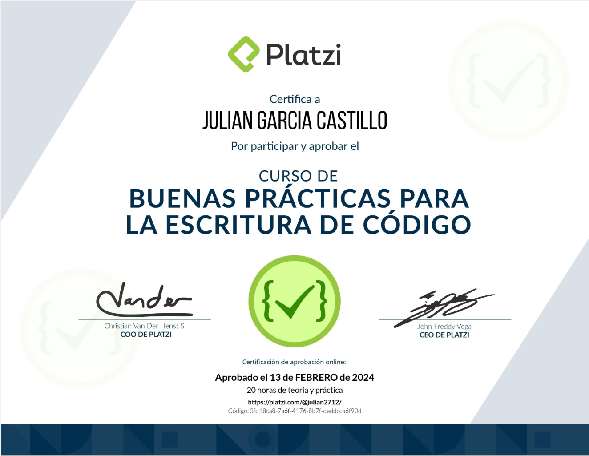

## Ruta PHP
### Curso 8

# Descripción
Escribe código legible y libre de vicios. Conoce los principios básicos para programar aplicaciones que sean fáciles de mantener y ampliar. Realiza pruebas en tu código para encontrar errores antes de enviar a producción y mejora tus habilidades para trabajar en equipos de desarrollo de software.
